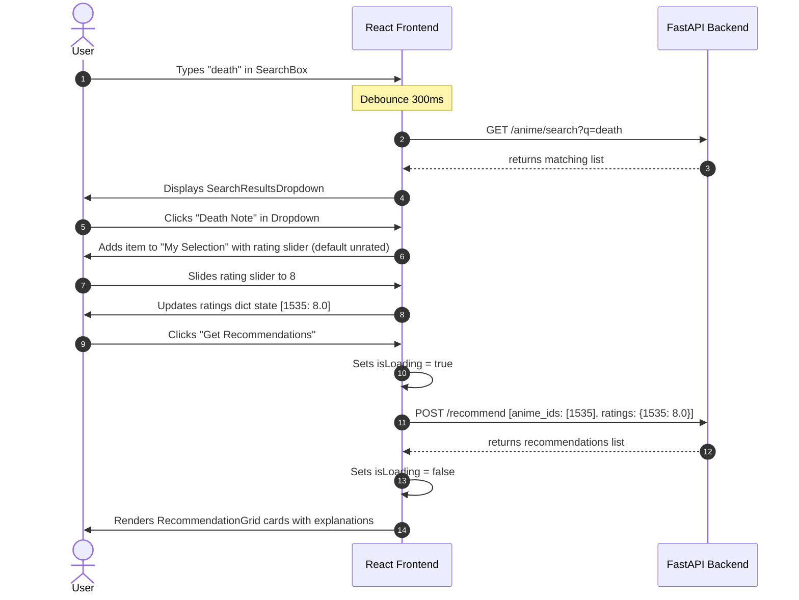

# CineSense Frontend V1 UI Design Specification

This document defines the visual layout, color palette, typography choices, component interfaces, and wireframes for the single-page CineSense user interface.

---

## 1. Typography & Color Palette

### Typography
We use premium Google Fonts imported at the top of the CSS stack:
* **Primary Body & Interface Font:** `Inter` (Sans-serif) - chosen for its high readability on dark screens and clean modern proportions.
* **Headers & Accents Font:** `Outfit` (Sans-serif) - a geometric sans-serif that gives the brand titles a premium, custom feel.

### Color Palette (Glassmorphic Dark Mode)
The interface is designed with a premium, sleek dark color scheme utilizing HSL variables for flexible opacity adjustments (perfect for borders, hover effects, and glassmorphic backing overlays).

| Token | HSL Value | Hex Equivalent | Description |
| :--- | :--- | :--- | :--- |
| `--bg-main` | `hsl(222, 47%, 11%)` | `#0f172a` | Deep slate-gray base background |
| `--bg-card` | `hsl(217, 33%, 17%)` | `#1e293b` | Slate-800 card backing |
| `--accent-primary` | `hsl(239, 84%, 66%)` | `#6366f1` | Premium indigo for CTA buttons and focus highlights |
| `--accent-neon` | `hsl(189, 94%, 43%)` | `#06b6d4` | Vibrant cyan for hovered items and subtle highlights |
| `--text-primary` | `hsl(210, 40%, 98%)` | `#f8fafc` | Ultra-bright slate for primary readability |
| `--text-secondary`| `hsl(215, 16%, 57%)` | `#94a3b8` | Cool gray for descriptions and metadata labels |
| `--accent-gold` | `hsl(38, 92%, 50%)` | `#f59e0b` | Gold star/ratings highlighting |
| `--accent-error` | `hsl(0, 84%, 60%)` | `#ef4444` | Crimson for warning boxes and invalid inputs |

---

## 2. Component Specifications

### 1. SearchBox & SearchResultsDropdown
* **Purpose:** Allows users to query the `/anime/search` API and presents a matching dropdown.
* **State Dependencies:**
  * `query` (string) - current input value.
  * `searchResults` (array of Anime) - search results retrieved.
  * `isSearching` (boolean) - loader state during debounced fetch.
* **Props:**
  * `onSelectAnime` (function) - callback when user selects an anime.
* **User Interactions:**
  * Typing invokes a debounced fetch after 300ms.
  * Pressing `Escape` closes the dropdown.
  * Clicking an item in the dropdown adds it to the selection list, resets the query, and hides the dropdown.

### 2. SelectedAnimeList & RatingInput
* **Purpose:** Displays the list of selected seeds and lets the user specify an optional rating (1.0 to 10.0).
* **State Dependencies:**
  * Inherits `selectedAnimeList` (array) and `ratings` (dict) from main App state.
* **Props:**
  * `items` (array) - list of currently selected anime.
  * `ratings` (dict) - active ratings dictionary.
  * `onRemove` (function) - removes an anime from selection.
  * `onRate` (function) - updates the rating for an anime.
* **User Interactions:**
  * Dragging the slider/slider step or clicking stars in `RatingInput` updates the rating value.
  * Clicking "Remove" removes the item from selection.

### 3. RecommendationGrid & RecommendationCard
* **Purpose:** Renders the recommendations returned by `/recommend`.
* **State Dependencies:**
  * `recommendations` (array of Recommendation) - from App state.
* **Props:**
  * `recommendations` (array) - results to display.
* **User Interactions:**
  * Hovering over `RecommendationCard` expands the card slightly with a neon cyan drop-shadow (micro-animation).

---

## 3. Desktop Wireframe Layout

```
+-----------------------------------------------------------------------------------------+
|  CINESENSE                                                           v1.0.0 (twostage)  |
+-----------------------------------------------------------------------------------------+
|                                                                                         |
|  [ Search anime by title...                                                        ] \  |
|  +-----------------------------------------------------------------------------------+  |
|  | * Death Note (1535)                                                               |  |
|  | * Death Parade (14353)                                                            |  |
|  +-----------------------------------------------------------------------------------+  |
|                                                                                         |
|  +--------------------------------------------+ +-------------------------------------+ |
|  | MY SELECTION (3 items)                     | | RECOMMENDATIONS                     | |
|  +--------------------------------------------+ +-------------------------------------+ |
|  | 1. Death Note                              | | [!] No recommendations yet. Select  | |
|  |    Rating: [=======o======] 8.0/10  [x]    | |     seeds and click Recommend!      | |
|  |                                            | |                                     | |
|  | 2. Code Geass                              | |                                     | |
|  |    Rating: [============o-] 9.0/10  [x]    | |                                     | |
|  |                                            | |                                     | |
|  | 3. Steins;Gate                             | |                                     | |
|  |    Rating: Unrated (1.0 default)    [x]    | |                                     | |
|  |                                            | |                                     | |
|  | +----------------------------------------+ | |                                     | |
|  | |         GET RECOMMENDATIONS            | | |                                     | |
|  | +----------------------------------------+ | |                                     | |
|  +--------------------------------------------+ +-------------------------------------+ |
|                                                                                         |
+-----------------------------------------------------------------------------------------+
```

---

## 4. Mobile Wireframe Layout

```
+------------------------------------------+
|  CINESENSE             v1.0.0 (twostage) |
+------------------------------------------+
|                                          |
|  [ Search anime by title...          ] \ |
|                                          |
|  +--------------------------------------+  |
|  | MY SELECTION (3 items)               |  |
|  +--------------------------------------+  |
|  | 1. Death Note                        |  |
|  |    Rating: [===o===] 5.0/10   [x]    |  |
|  |                                      |  |
|  | 2. Code Geass                        |  |
|  |    Rating: [======o] 8.0/10   [x]    |  |
|  |                                      |  |
|  | +----------------------------------+ |  |
|  | |       GET RECOMMENDATIONS        | |  |
|  | +----------------------------------+ |  |
|  +--------------------------------------+  |
|                                          |
|  +--------------------------------------+  |
|  | RECOMMENDATIONS                      |  |
|  +--------------------------------------+  |
|  | +----------------------------------+ |  |
|  | | Attack on Titan            98.5% | |  |
|  | | Recommended because it is highly | |  |
|  | | similar to 'Death Note'...       | |  |
|  | +----------------------------------+ |  |
|  +--------------------------------------+  |
|                                          |
+------------------------------------------+
```

---

## 5. User Interaction Flow


